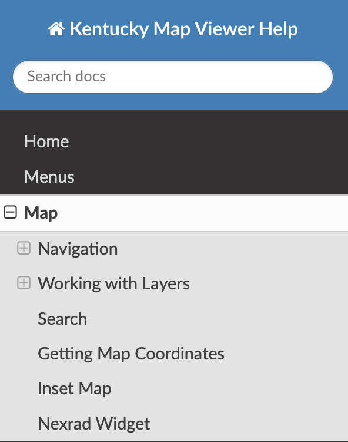

# Home

This page is intended to provide some basic instructions for using a Kentucky Map Viewer.  DGI's implementation of the Web Apps built using the ArcGIS Experience Builder Developer Edition is similar to out-of-the-box templates provided by Esri. Use the links in the navigation pane on the left to quickly access a specific help topic.

Direct link to Map [documentation](map/index.md)

<table style="width:100%; border-collapse: collapse;">
  <tr>
    <td style="vertical-align: top; width: 60%; padding-right: 20px;">
      <h3>Table of Contents</h3>
      <ul>
        <li>Home</li>
        <li>Menus</li>
        <li>Map/li>
        <li>Navigation
          <ul>
            <li>Button Navigation</li>
            <li>Keyboard Navigation</li>
            <li>Mouse Navigation</li>
          </ul>
        </li>
        <li>Working with Layers
          <ul>
            <li>Base Layers</li>
            <li>Thematic Layers</li>
          </ul>
        </li>
        <li>Search</li>
        <li>Getting Map Coordinates</li>
        <li>Inset Map</li>
        <li>Nexrad</li>
      </ul>
    </td>
    <td style="vertical-align: top; text-align: center; width: 30%;"> 
      
    </td>
  </tr>
</table>

## Available Webmap Apps
>>
| Title                                | Link                                                                        |
| -------------------------------------| --------------------------------------------------------------------------- |
| The Commonwealth Basemap             | [https://kygeonet.ky.gov/tcm](https://kygeonet.ky.gov/tcm)                  |
| KyFromAbove Before & After           | [https://kygeonet.ky.gov/beforeafter](https://kygeonet.ky.gov/beforeafter)  |
| Kentucky's Hunting and Fishing Sites | [https://kygeonet.ky.gov/kdfwr](https://kygeonet.ky.gov/kdfwr)              |
| Kentucky Water Mapping               | [https://kygeonet.ky.gov/kia/dw](https://kygeonet.ky.gov/kia/dw)            |
| Kentucky Wastewater Mapping          | [https://kygeonet.ky.gov/kia/cw](https://kygeonet.ky.gov/kia/cw)            |
| Kentucky Adventure Tourism           | [https://kygeonet.ky.gov/kyadventure](https://kygeonet.ky.gov/kyadventure)  |
| Kentucky's Incorporated Cities       | [https://kygeonet.ky.gov/kycities](https://kygeonet.ky.gov/kycities)        |
| Kentucky Legislative Districts       | [https://kygeonet.ky.gov/kydistricts](https://kygeonet.ky.gov/kydistricts)  |
| Kentucky Library Locations           | [https://kygeonet.ky.gov/kylibraries](https://kygeonet.ky.gov/kylibraries)  |
| Kentucky Parks                       | [https://kygeonet.ky.gov/kyparks](https://kygeonet.ky.gov/kyparks)          |
| Kentucky Schools                     | [https://kygeonet.ky.gov/kyschools](https://kygeonet.ky.gov/kyschools)      |
| Kentucky School Districts            | [https://kygeonet.ky.gov/kyschooldistricts](https://kygeonet.ky.gov/kyschooldistricts) |
| Kentucky Soils Data Viewer           | [https://kygeonet.ky.gov/kysoils](https://kygeonet.ky.gov/kysoils)          |
| Kentucky's Recreation Trails         | [https://kygeonet.ky.gov/kytrails](https://kygeonet.ky.gov/kytrails)        |
| Kentucky Weather Map                 | [https://kygeonet.ky.gov/kyweather](https://kygeonet.ky.gov/kyweather)      |
| Kentucky Geodetic Control            | [https://kygeonet.ky.gov/ngs](https://kygeonet.ky.gov/ngs)                  |
| Webster County PVA                   | [https://kygeonet.ky.gov/pva/webster](https://kygeonet.ky.gov/pva/webster)  |  

## Other Websites and Apps
>>
| Title                                  | Link                                                                        |
| ---------------------------------------| --------------------------------------------------------------------------- |
| KyFromAbove Home Page                  | [https://kyfromabove.ky.gov/](https://kyfromabove.ky.gov/)                  |
| KyFromAbove Explorer - Oblique Imagery | [https://explore.kyfromabove.ky.gov/](https://explore.kyfromabove.ky.gov/)  |
| Kentucky State Plane Coordinate System | [https://geodesy.ky.gov](https:geodesy.ky.gov/)                             |
| KyFromAbove Stac-Browser               | [https://kygeonet.ky.gov/stac](https://kygeonet.ky.gov/stac)                |
| KyGeoNet Home Page.                    | [https://kygeonet.ky.gov/](https://kygeonet.ky.gov/)                        | 

___
If the Help navigation pane is collaped, you can use the burger button to navigate the help menu.

    
    <figcaption><strong>Figure 1:</strong> Navigation pane collapsed.</figcaption>

  