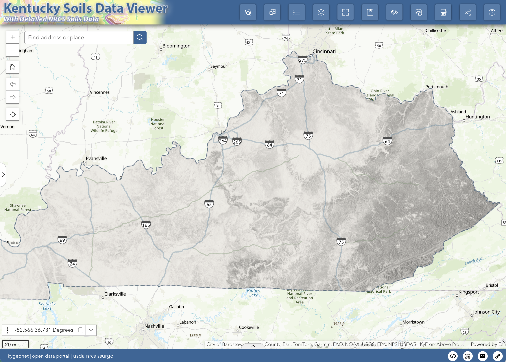
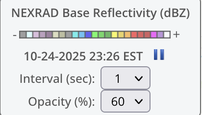

# Map

The map layout may vary from app to app but the map tool functionality will be consistent.

  
  <!-- width="650" height="auto"  /> -->

## Navigation

### Button Navigation

|  Tool                                 | Description                            |
| ------------------------------------- | -------------------------------------- |
|    | Clicking plus (+) and (-) zoom the map in and out. By default, the map uses the [Bing Maps](https://learn.microsoft.com/en-us/bingmaps/articles/bing-maps-tile-system) scale. |
|     | The home button returns the map to the default extent (statewide). |
|  | These buttons allow the user to navigate to previous and next extents while using the map. |
|   | The locate icon ceneters on your location. *Location Services must be enabled* |

### Keyboard Navigation 

Navigating the map by using the keyboard is very effective. Zooming, panning, and other actions can be performed with a keystroke or combined keystroke and mouse action.

Panning the map can be achived using the arrows keys on the keyboard. The UP arrow pans North, the DOWN arrow pans South, the RIGHT arrow pans East, and the LEFT arrow pans West.

Zooming in and out can be achieved by using the Shift key and either the "+" or the "-" key on a numeric keypad.

Another great way to zoom in is to hold down on the Shift key and then click and drag a rectangle on the map to define the zoom area.  See the table below for some examples.

>>>>>
| Keystroke                  | Map Action  |
| -------------------------- | ----------- |
| Up arrow | Pans north |
| Down arrow | Pans south |
| Right arrow | Pans east |
| Left arrow | Pans west |
| N  | Aligns map to the north |
| Shift and drag | Zoom in by drawing a rectangle |
| Shift and click | Zoom in to the pointer location |
| Ctrl + click | Center view on pointer location |

### Mouse Navigation 

Navigating the map can also be done with the mouse.

Scroll the mouse wheel forward or up to zoom in or backward to zoom out.

Hold the Shift key down, then hold the left mouse button down and drag to draw a rectangle. The map will zoom in to the area of the rectangle.  See the table below for some combinations.

>>>>>
| Keystroke                           | Action                                |
| ----------------------------------- | ------------------------------------- |
| Left Click   | Pop-up / Pan |
| Wheel | Zoom in & out |
| Right Click & Hold | Rotate |
| Shift + Left + Drag | Draw a rectangle to zoom|

## Search 

The search tool leverages different geocoding services to enable searching for a geolocation.
Location types include address, coordinates, named places, etc.
We recommend using the <em>KY NG911 Locator</em> for best results.

  

## Getting Map Coordinates

Obtaining a Map Coordinate:  The Coordinate Widget is positioned in the lower left corner of the map viewer just above the graphic scale bar. Note that moving the mouse causes the values to change based on the current position of the mouse on the map.

  

  
To obtain a map coordinate, click on the icon  at the left of the coordinate values.

Doing this changes the mode of the coordinate tool to allow for getting map coordinates that can be copied. Note that the tool now says *Click the map to get coordinates*.

  

Then, simply click on the map and the coordinate value will be placed in the tool. If you need to copy the value, select the copy icon and hit *Ctrl + C*, then paste the value where you desire.

You can also change the coordinate system for the map tool but clicking the arrow button on the right.

  

## Inset Map

In the lower right corner, there is a smaller arrow that toggles open an inset map.  This provides relative location when zoomed at very high scales.

  

## Nexrad Widget

    

*Note: Currently, this widget is only available in the [KyWeather App](https://kygeonet.ky.gov/kyweather)*

The Nexrad Widget displays the Iowa Environment Mesonet generated [NEXRAD Mosaics](https://mesonet.agron.iastate.edu/docs/nexrad_composites/) for the last hour in five minute intervals.  

    

___

>>
| Dropdown | Description |
| ------------- | ----------- |
| 

 | This dropdown menu provides a selection of intervals in seconds in which to cylce through the 11 layers. | 
| 

 | This dropdown menus changes the opacity of the layers. |
