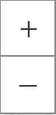
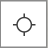
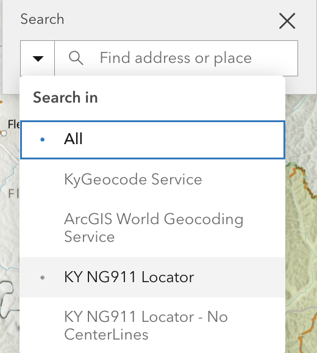
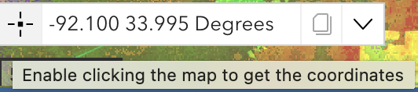
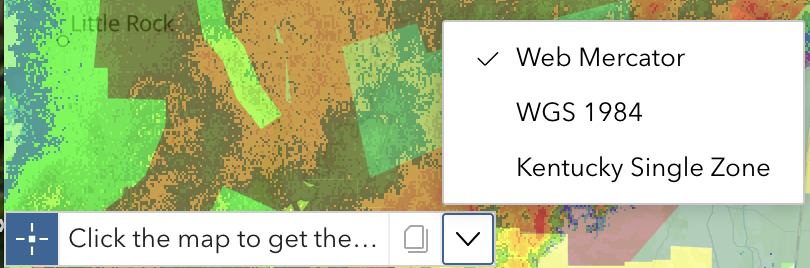
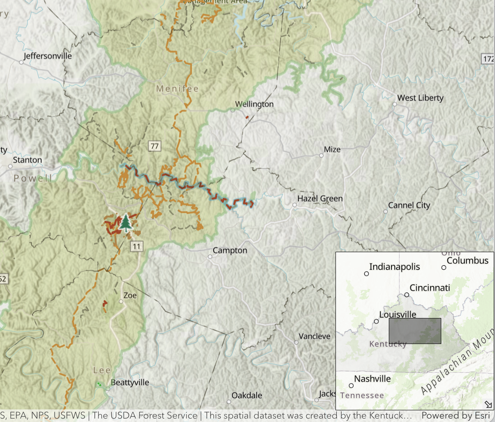
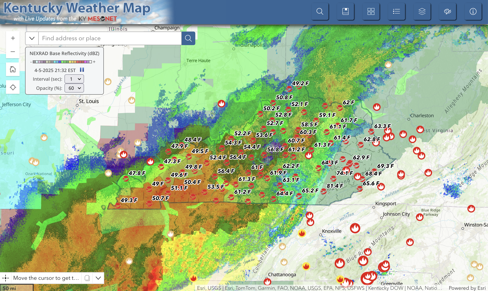
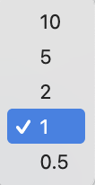
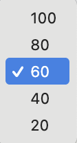

# Map

The map layout may vary from app to app but the map tool functionality will be consistent.

## Navigation

|  Tool                                 | Description                            |
| ------------------------------------- | -------------------------------------- |
|    | Clicking plus (+) and (-) zoom the map in and out. By default, the map uses the [Bing Maps](https://learn.microsoft.com/en-us/bingmaps/articles/bing-maps-tile-system) scale. |
|     | The home button returns the map to the default extent (statewide) |
|        | Clicking on this icon will center the map on your location. Note that Location Services must be enabled within your browser or mobile device in order for this function to work. |

## Search 

  
  

    The search tool leverages different geocoding services to enable searching for a geolocation.
    Location types include address, coordinates, named places, etc.
    We recommend using the <em>KY NG911 Locator</em> for best results.
  

 

## Getting Map Coordinates

Obtaining a Map Coordinate:  The Coordinate Widget is positioned in the lower left corner of the map viewer just above the graphic scale bar. Note that moving the mouse causes the values to change based on the current position of the mouse on the map.

  

To obtain a map coordinate, click on the icon  at the left of the coordinate values.

Doing this changes the mode of the coordinate tool to allow for getting map coordinates that can be copied. Note that the tool now says "Click the map to get coordinates".

  

Then, simply click on the map and the coordinate value will be placed in the tool. If you need to copy the value, select it in the tool and hit Ctrl + C then paste the value where you desire.

You can also change the coordinate system for the map tool but clicking the arrow button on the right.

  

## Inset Map

In the lower right corner, there is a smaller arrow the toggles open an inset map.  This provides relative location when zoomed at very high scales.

  

## Nexrad Widget

*Note: Currently, this widget is only available in the [KyWeather App](https://kygeonet.ky.gov/kyweather)*

The Nexrad Widget displays the Iowa Environment Mesonet generated [NEXRAD Mosaics](https://mesonet.agron.iastate.edu/docs/nexrad_composites/) for the last hour in five minute intervals.  

    

| Dropdown | Description |
| ------------- | ----------- |
|  | This dropdown menu provides a selection of intervals in seconds in which to cylce through the 11 layers. | 
|  | This dropdown menus changes the opacity of the layers. |
