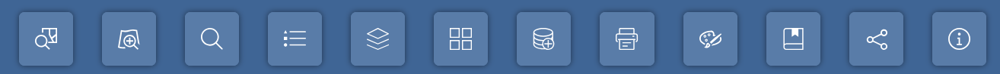

# Widgets Menu

The main toolbar can contain tools that interact with the map, bring up a widget dialog, or provide information.

| Icon | Description |
| ---- | ----------- |
|       | The Zoom to County widget allows users to zoom to a particular County. |  
|           | The Zoom to City widget widget allows users to zoom to a particular City.  | 
|   | This widget allows users to zoome to schools and hospitals.  |   
|                      | The Legend widget shows the symbology of map layers and changes as layers are turned on or off. |
|                       | The Map Layers widget shows the layers in the map and allows users to turn them on, off, change the transparency, zoom to that layer, or even open the attribute table. |
|                   | The Base Map widget allows users to select from a gallery of available base map layers. |
|                   | The Add Data widget allows users to add data to the map from a URL or file (*Shapefile, CSV, KML, GeoJSON, GPX*). |
|                         | Print a variety of maps with some customization.                                                           |  
|                           | The drawing widget allows users to add text or draw on the map. Some versions also allow you to measure areas and distances as well. |
|                 |  This widget displays a list of predefined spatial bookmarks. Users can add and delete bookmarks and those changes are maintained on your computer unitl  you empty your browser cache. |
|                         | Share the map via 1) embed, 2) QR code, 3) email, and 4) Link. |
|                    | A widget that links back to the help page. |   

